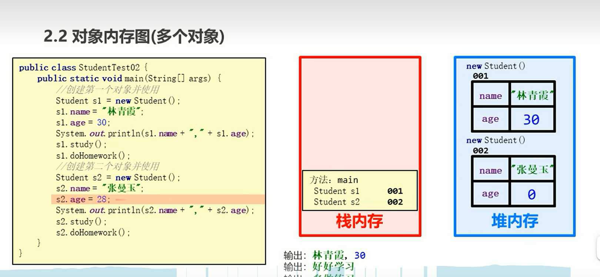
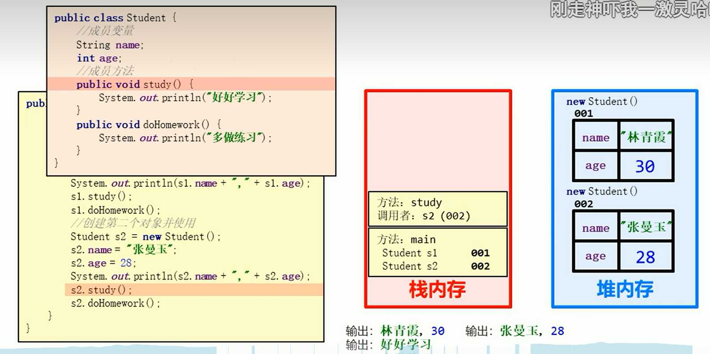
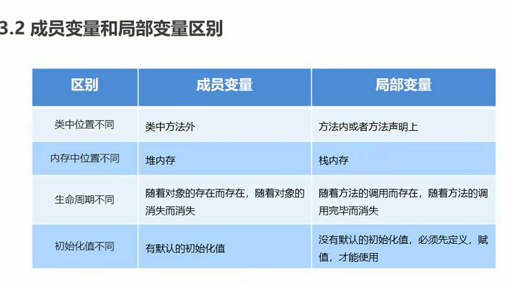

## 类

1. 是一种抽象的数据类型，它是对一类事物的具体描述/定义,但不是一个具体的事物

2. 是java程序的基本组成单位

3.  当我们采用面向对象的方式贯穿整个系统的话，涉及到三个术语：

   ​    OOA：面向对象分析
   ​	OOD：面向对象设计
   ​	OOP：面向对象编程
   ​	整个软件开发的过程，都是采用OO进行贯穿的。

   ​	实现一个软件的过程：
   ​	分析(A) --> 设计(D) --> 编程(P)

4. 面向对象包括三大特征

   ​    封装
   ​	继承
   ​	多态

5.  什么是类？

   类就是一个模板：类中描述的是所有对象的“共同特征信息”
   
6.  什么是对象

   对象就是通过类创建出的个体。

7.  

8. 这几个术语你需要自己能够阐述出来：

   - 类：不存在的，人类大脑思考总结一个模板（这个模板当中描述了共同特征。） 

   - 对象：实际存在的个体。

   - 实例：对象还有另一个名字叫做实例。

   - 实例化：通过类这个模板创建对象的过程，叫做：实例化。

   - 抽象：多个对象具有共同特征，进行思考总结抽取共同特征的过程。

     类 --【实例化】--> 对象(实例)
     对象 --【抽象】--> 类

     类的定义
     	[修饰符列表] class 类名 {
     		//类体 = 属性 + 方法
     		// 属性在代码上以“变量”的形式存在（描述状态）
     		// 方法描述动作/行为
     	}

     **注意**：修饰符列表可以省略。

9.  关于编译的过程
    ```tex
    按说应该先编译XueSheng.java，然后再编译XueShengTest.java
    但是对于编译器来说，编译XueShengTest.java文件的时候，会自动
    找XueSheng.class.
    第一种方式：	
    javac XueSheng.java
    javac XueShengTest.java
    第二种方式：
    javac XueShengTest.java
    第三种方式：
    javac *.java
    ```

   

10.  在语法级别上是怎么完成对象创建的呢？

    类名 变量名 = new 类名();
    这样就完成了对象的创建。

11.  什么是实例变量？

    对象又被称为实例。
    实例变量实际上就是：对象级别的变量,也叫成员变量。
    注意：对于成员变量来说，没有手动赋值时，系统默认赋值。

12.  类型与默认值

| 类型     | 默认值                                                       |
| -------- | ------------------------------------------------------------ |
| bytes    | 0                                                            |
| short    | 0                                                            |
| int      | 0                                                            |
| long     | 0L                                                           |
| float    | 0.0f                                                         |
| double   | 0.0                                                          |
| boolean  | false                                                        |
| char     | \u0000                                                       |
| 引用类型 | null
null是一个java关键字，全部小写，表示空。是引用类型的默认值。 |

##### 对象和引用的区别？

对象是通过new出来的，在堆内存中存储。
引用是：是变量，并且该变量中保存了内存地址指向了堆内存当中
的对象的。


## 对象

 是一个具体的事物 



对象会存储在栈内存中，获取到一个堆内存地址

类的属性会存储在堆内存中，初始化类定义时的值，没有给时是默认值

## 类的组成

- 属性 ：成员变量
- 行为：成员方法

### 对象定义



方法在调用时进入栈内存中，s1.study()，指明调用者，用完及销毁


当多个对象指向同一个堆内存地址值时 Student s2 = s1; 修改s2的值会影响s1的值

.jpg)

### 成员变量与局部变量

- 成员变量：类中方法外定义的变量
- 局部变量：方法中定义的变量



## new关键字

- 使用new关键字创建对象时，除了分配内存空间外，要给创建好的对象分配内存空间，还会调用构造器

## 构造方法

类中的构造器成为构造方法，是在调用对象时必须调用的

类似与Python的_ _ init _ _类似,但是可以写出多个构造器，给类初始化需要的值

java 的new 对象过程就是一个调用构造器的过程

**构造器特点**

1. 必须和类的名字一致
2. 必须没有返回类型
3. 不能使用void关键字
4. 必须和类的修饰器相同，public class Person的构造器就是public Person(){}  
   1. private class T的构造器就是private T(){}
   2. class T0 的构造器就是class T0(){}

5. 构造方法支持重载，所以可以书写多个构造器，并且所有构造器的名字必须相同

**构造器必须掌握**

- 注意点
  1. 没有书写构造方法时，默认生成一个没有参数的构造方法（缺省构造器）
  1. 定义有参构造之后，还想要使用无参构造，需要再定义一个无参构造器

易混淆点：

1. 实例变量在类加载是初始化吗？实例变量在什么时候初始化？
   - 不是
   - 实际变量是在构造方法执行过程中完成初始化，完成赋值的
   - 构造器在使用new时率先执行

### 类属性方法访问总结

```tex
在同一类中,如果是静态方法的话,则可以调用静态变量或
者静态方法,但是不可以调用实例变量跟实例方法.
除非new对象再来访问实例变量跟实例方法.在同一
类中,如果是实例方法的话,则可以调用实例变量,实例
方法,静态变量,静态方法.
```

