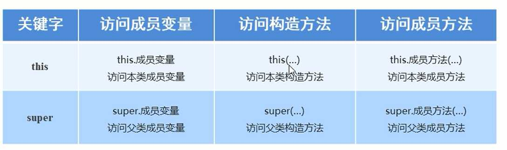

## 继承

关键字:extends

格式： public class 子类名 extends 父类名{}

fu： 是父类，也被称为基类与超类

zi：是子类，也被称为衍生类

```java
package com.kuang.oop.demo05;

public class Person {
    private int money = 1000_000_000;
    public String first_name = "李";
    public void say(){
        System.out.println("说了一句话");
    }
}

```

```java
// 子类
package com.kuang.oop.demo05;

public class Student extends Person{

}
```

```java
// 多个子类
package com.kuang.oop.demo05;

public class Teacher extends Person {

}

```

继承是类与类之间的关系

除此之外类与类之间的关系还有

- 依赖
- 组合
- 聚合 等

继承关系的两个类

- 子类（派生类）
- 父类（基类）

类的执行

```java
package com.kuang.oop;


import com.kuang.oop.demo05.Student;

public class Application {
    public static void main(String[] args) {
        Student student = new Student();
        student.say();  // 说了一句话
        System.out.println(student.first_name);  // 李
        System.out.println(student.money);  // 报错，Student中没有money属性
        
    }
}

```

所以：公共方法与属性可以被子类继承，但是私有的不可以

继承中变量的访问特点

优先级： 局部变量 --> 本类成员变量 ---> 父类成员变量

访问本类的成员变量：this.变量名

访问本类的成员变量：super.变量名

### this与super的用法



#### 构造方法的问题：

1. 创建子类的无参对象时为什么：先调用父类的无参构造方法，再调用子类的无参构造方法
2. 创建子类的有参对象时为什么：先调用父类的无参构造方法，再调用子类的有参构造方法

##### 解答：

- 子类的所有构造方法默认都会访问父类中的无参构造方法
  - 原因：子类会继承父类中的数据，可能还会使用父类的数据，所以子类初始化之前一定需要先完成父类的初始化。
  - 每一个子类的构造方法第一条语句默认是super()
- 当父类的无参构造方法不存在时，子类的构造方法需要做
  - 1. 手动书写super()
    2. 传入需要的参数
    3. 注意super必须在方法的第一行
  - 或者去书写父类的无参构造方法


#### 方法调用的问题：

1.存在相同方法时：调用谁的方法？

2.怎么样调用父类的方法？

##### 解答：

- 先在子类中寻找
- 再去父类中进行寻找
- 都不存在时报错
- super.方法名(参数)


快捷键：

​	F4/ctrl+h 可以快捷打开继承树

​	Navigate+Hierarchy

继承树中显示

person类的父类是object,所有没有指明继承关系的类，父类都是object

## 继承的注意事项

- java只支持单继承，不可以多继承
- java可以支持多层继承