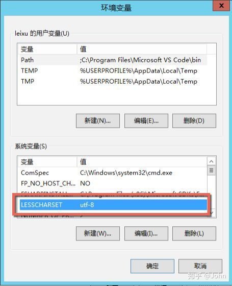

## 第一步

打开你的终端，依次输入以下命令：

$ git config --global core.quotepath false # 设置 git status utf-8编码

$ git config --global gui.encoding utf-8 # 设置Git GUI界面utf-8编码

$ git config --global i18n.commit.encoding utf-8 #设置commit信息utf-8编码

$ git config --global i18n.logoutputencoding utf-8 # 设置输出 log utf-8 编码

## 第二步

新建系统环境变量 LESSCHARSET并赋值为utf-8。

