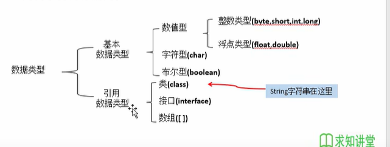

## 声明变量

数据类型 变量=值

## 数据类型

1. **整数**

   1. bytes 字节，8bit     byte num = 10;
   2. short 短整数 16bit 2byte   short num = 10;
   3. int 整数 32bit 4byte  int num = 10;
   4. long 长整数64bit 8byte long num = 10L;

2. **小数**

   1. float 单精度小数 32bit 4byte   float num = 50.1F或float num = 50.1f; 
   2. double 双精度小数 64bit 8byte  double num=10.11111;

3. **boolean** 布尔值

   boolean 布尔值 8bit 1byte  true false  boolean = true;

5. **字符**

   1. char 单一文字符号，unicode编码 16bit 2bytes

      必须使用单引号

      注意：string 不是关键字 是一个类



### 自动变量类型转化


### int 整数

数字运算

- +
- -
- *
- /  除以
- % 余
- ++
- --

```java
int a =10;

a = 20;

// 初次定义变量时需要定义变量类型

// 在此使用变量时不用再定义数据类型
double d = 1.25;
```

```/
int a = 10;
int b = 20;
int d = 1.22;
a+c == 11.22；
a/b == 0
除以运算时，两端都是整数时结果也是整数
int c = 3
a%c = 1
```

#### ++a 与a++不同

```/
int a = 10;
System.out.println(a++); // 10
System.out.println(++a); // 11
++a  先执行a = a+1 再输出a
a++  先输出a , 再执行a = a+1
```

#### +=

```java
shor i =10;
i+=20;
// 不报错 直接计算出30
i = i+20;
// 报错，提示short类型不能强制计算
// 修改为
i = (short)(i+20);
// 注意 现在i也是一个int
```


### boolean 布尔值

真为true，假为false 、

默认值是false

### 小数

**double** 64bit 8bytes  双精度浮点数

**float** 32bit 4bytes 单精度浮点数

```java
public class Var2{
    public static void main(String[] args){
        float a = 0.1234567890123f; // 必须以f或F结尾
        System.out.println(a); //0.12345679
        // 最多保留小数后8位 会将第9为进行四舍五入
        double b = 0.12345678901234567890;
         System.out.println(b); // 0.12345678901234568
        // 最多保留17位小数
    }
}
```


### 字符

- char 16bit unicode标准
- char 可以存放数字，但是数字实际时以字符串格式存放的

```java
public class TestVar3 {
    public static void main(String[] args) {
        char c = 'a'; // 必须使用单一字符
        System.out.println(c);
        char d = 65;
        System.out.println(d);
    }
}
```


字符串可以与数字类型进行拼接

数字类型与字符串发生拼接时，自动转换成字符串再进行拼接

```java
public class Var1{
    public static void main(String[] args){
        String s1 = '周';
        String s2 = '困';
        System.out.println(s1); // 周
        System.out.println(s1+s2);//困
        System.out.println(s1 + 1 + 1); // 周11
        System.out.println(1+1+s1); // 2周
        System.out.println("周"+(1+1));  // 周2
    }
}
```

### 数据类型的转换

数据量大小

​	byte -> short,char ->int ->long ->float ->double

小数据类型->大数据类型：安全的直接转化

大数据类型-> 小数据类型 ：不一定安全，存在安全隐患，必须强制转换

如果最大值溢出会产生错误数据


```java
public class TeatVar5 {
    public static void main(String[] args) {
        int a = 10;
        int b = a;
//        System.out.println(b);   //10
        long c = 10000000000L;
        int d = (int) c;
        System.out.println(d);  // 1410065408
        // 超过了int的最大值，所以溢出了，产生错误值

        double e = 3218897.623215;
        int f = (int) e;
        System.out.println(f); // 3218897,直接去除小数部分
    }
}
```

### 数据类型之间的运算

1. 相同数据类型之间的运算

   int+int =int

   int \ int = int   10 \ 3  =3

2. 不同数据类型之间

   首先把小的数据类型自动转换成大的数据类型，然后再进行计算，得到大的数据类型

   int + long = long

3. 特殊类型 char, short,byte，都会自动变为int类型开始进行计算

   byte:

   ​	在计算时，首先会转化为int类型在进行计算

   byte+byte = int

   ```java
   byte a = 10;
   byte b = 10;
   int c = a+b;
   // 使用byte c = a+b 报错
   ```

   ```java
   short a = 10;
   short b = 10;
   short c = (short)(a+b);
   ```

   
