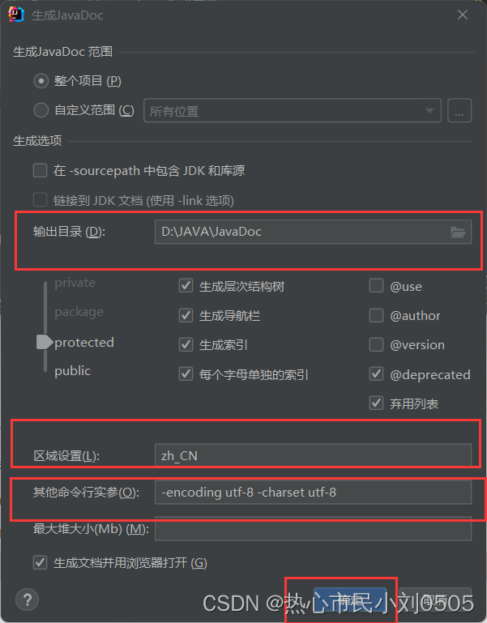

JavaDoc  

### javadoc命令是用来生成自己的api文档

#### 参数信息

- @auther 作者名
- @version 版本号
- @since  指明需要最早使用的jdk版本 
- @param 参数名
- @return 返回值情况
- @throws 异常抛出情况

```java
/**
 * @author LL
 * @version 1.0
 * @since 1.8
 */
public class Demo1 {
    /**
     * 
     * @param args
     * @throws Exception
     */
    public static void main(String[] args) throws Exception{

    }
}
```

F:\first\src\com\kuang\base>Javadoc -encoding UTF-8 -charset UTF-8 Doc.java
正在加载程序包Doc.java的源文件...
javadoc: 警告 - 没有程序包Doc.java的源文件
正在构造 Javadoc 信息...
javadoc: 警告 - 没有程序包Doc.java的源文件
javadoc: 错误 - 找不到可以文档化的公共或受保护的类。
1 个错误
2 个警告

问题为解决

#### IDEA协助自动生成文档

**工具（Tools）** -->  **生成javadoc（Generate JavaDoc）**

