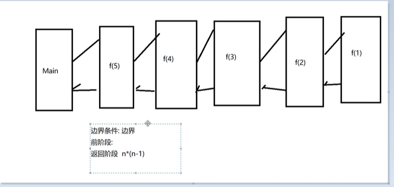

```java

public class Demo05 {
    public static void main(String[] args) {
        System.out.println(f(5));
    }
    public static int f(int n){
        if (n==1){
            return 1;
        }else{
            return n*f(n-1);
        }
    }
}
```



注意 ：递归次数不能太多，消耗很大