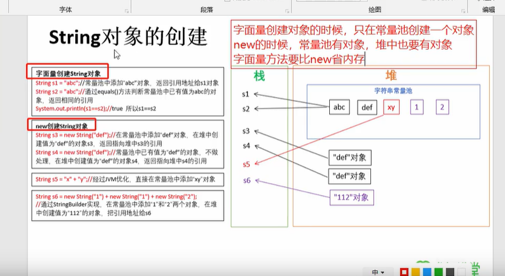

# Sring


String 类在java.lang下，不需要导包使用

底层是 char[],java9后是bytes[]


## String 创建方法

- 字面量创建对象
  - String s1 =‘abc’; String s2 =‘abc’;
  - 将字符串常量池中的地址返回给s1或s2
- new创建String对象
  - string s3 = new String (“def”); String s4 = new String(“def”)
  - 1先在常量池中创建def字符串
  - 2在堆中创建def对象
  - 将def对象的内存地址指向s3
  - s4 创建过程
    - 先查询字符串常量池中是否存在def，存在不做处理
    - 堆中创建一个def对象
    - 注意s3与s4的def对象不是同一个
- 区别是字面量创建对象时，只在常量池创建一个对象
- new对象需要再常量池中创建对象，还要再堆中创建一个对象
- 字面量比new省内存
- String s5 = “x”+“y”
- string s6 = new String(“1”)+new String(“1”)+new String (“2”)



### 字符串的比较

使用==做比较

- 基本类型：比较数据值是否相同
- 引用类型：比较地址值是否相同

字符串对象比较内容相同，使用

**equals()**

```java
public class Demo01 {
    public static void main(String[] args) {
        char [] chs = {'a','b','c'};
        String s1 = new String(chs);
        String s2 = new String(chs);
        String s3 = "abc";
        String s4 = "abc";
        // 比较地址是否相同
        System.out.println(s1==s2);  // false
        System.out.println(s2==s3);  // false
        System.out.println(s3==s4);  // true
        System.out.println("=========================");
        // 比较字符串内容是否相同
        System.out.println(s1.equals(s2)); // true
        System.out.println(s2.equals(s3)); // true
        System.out.println(s3.equals(s4)); // true
    }
}
```

字符串的遍历

```java
package com.kuang.String_demo;

import java.util.Scanner;

public class Demo02 {
    public static void main(String[] args) {
        Scanner sc = new Scanner(System.in);
        System.out.println("请输入一个字符串");
        String line = sc.nextLine();

        for (int i = 0; i < line.length(); i++) {
            System.out.println(line.charAt(i));
        }
    }
}
```


## StringBuilder

概述：StringBuilder是一个可变的字符串类，我们可以把他当做一个容器

可变： StringBuilder对象的内容是可变的

string与StringBuilder区别

- string 不可变

- StringBuilder是可变的

在StringBuilder中，可以直接使用append和reverse方法。

append(任意数据类型)

```java
sb.append("hello").append("world").append(100);
System.out.println(sb.reverse());
```

string与StringBuilder的相互转换

- toString()  将 StringBuilder类型转换为String

  ```java
  public static void main(String[] args) {
          StringBuilder sb = new StringBuilder();
          sb.append("LL");
          System.out.println(sb);
  //        String s =sb;  // 报错
          String s = sb.toString();
          System.out.println(s);
      }
  ```

- StringBuilder(String s)  将String转换成StringBuilder

  ```java
   public static void main(String[] args) {
          String s = "hello";
  //        StringBuilder sb = s;  // 报错
          StringBuilder sb = new StringBuilder(s);
          System.out.println(sb);
      }
  ```

拼接字符串

```java
public class ArrToString {
    public static void main(String[] args) {
        int[] arr = {1, 2, 3, 4};
        String ss = demo(arr);
        System.out.println(ss);
    }

    // 将arr转成 [1,2,3,4]的string类型返回
    public static String demo(int[] arr) {
        StringBuilder sb = new StringBuilder();
        sb.append("[");
        for (int i = 0; i < arr.length; i++) {
            if (arr[arr.length - 1] == arr[i]) {
                sb.append(arr[i]);
            } else {
                sb.append(arr[i] + ", ");
            }
        }
        sb.append("]");
        return sb.toString();
    }
}
```

反转String类型数据

```java
public class StringUseReverse {
    public static void main(String[] args) {
        String s = "abcdefg";
        System.out.println(myReverse(s));
    }
    public static String myReverse(String s){
        return new StringBuilder(s).reverse().toString();
    }
}
```
