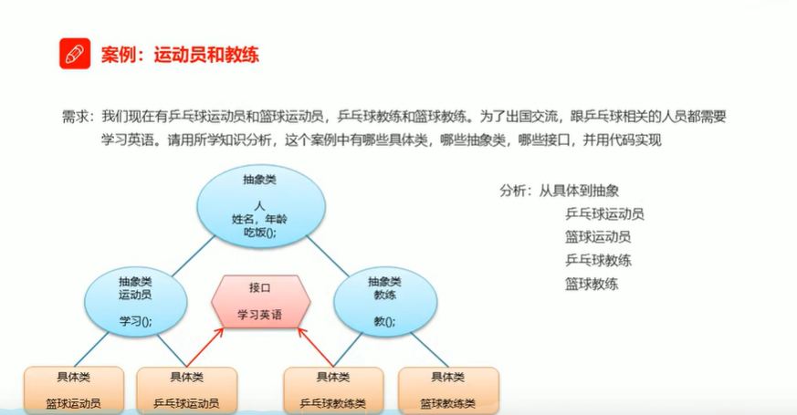

准备工作

### 抽象类人

```java
package com.jiekou.anli.运动员与教练;

public abstract class People {
    private String name ;
    private int age;

    public People() {
    }

    public People(String name, int age) {
        this.name = name;
        this.age = age;
    }

    public String getName() {
        return name;
    }

    public void setName(String name) {
        this.name = name;
    }

    public int getAge() {
        return age;
    }

    public void setAge(int age) {
        this.age = age;
    }

    public abstract void eat();
}

```

### 抽象类 运动员

```java
package com.jiekou.anli.运动员与教练;

public abstract class Player extends People{
    public Player() {
    }

    public Player(String name, int age) {
        super(name, age);
    }

    public abstract void study();
}
```

抽象类 教练

```java
package com.jiekou.anli.运动员与教练;

public abstract class Teacher extends People{
    public Teacher() {
    }

    public Teacher(String name, int age) {
        super(name, age);
    }

    public abstract void teach();
}
```

### 接口 说英语

```java
package com.jiekou.anli.运动员与教练;

public interface LearnEnglish {
    public abstract void sayEnglish();
}
```

### 乒乓球教练

```java
package com.jiekou.anli.运动员与教练;

public class PingPangT extends Teacher implements LearnEnglish{
    public PingPangT() {
    }

    public PingPangT(String name, int age) {
        super(name, age);
    }

    @Override
    public void eat() {
        System.out.println("我是乒乓球教练，吃牛肉");
    }

    @Override
    public void teach() {
        System.out.println("教学乒乓球");
    }

    @Override
    public void sayEnglish() {
        System.out.println("乒乓球教练说英语");
    }
}
```

### 乒乓球运动员

```java
package com.jiekou.anli.运动员与教练;

public class PingPangP extends Player implements LearnEnglish{
    public PingPangP() {
    }

    public PingPangP(String name, int age) {
        super(name, age);
    }

    @Override
    public void sayEnglish() {
        System.out.println("学习了英语");
    }

    @Override
    public void eat() {
        System.out.println("我是乒乓球运动员，吃席");
    }

    @Override
    public void study() {
        System.out.println("积极训练乒乓球");
    }
}
```

### 篮球教练

```java
package com.jiekou.anli.运动员与教练;

public class PingPangT extends Teacher implements LearnEnglish{
    public PingPangT() {
    }

    public PingPangT(String name, int age) {
        super(name, age);
    }

    @Override
    public void eat() {
        System.out.println("我是乒乓球教练，吃牛肉");
    }

    @Override
    public void teach() {
        System.out.println("教学乒乓球");
    }

    @Override
    public void sayEnglish() {
        System.out.println("乒乓球教练说英语");
    }
}
```

### 篮球运动员

```java
package com.jiekou.anli.运动员与教练;

public class BasketballP extends Player {
    public BasketballP() {
    }

    public BasketballP(String name, int age) {
        super(name, age);
    }

    @Override
    public void eat() {
        System.out.println("我是篮球运动员，喝牛奶");
    }

    @Override
    public void study() {
        System.out.println("积极学习篮球");
    }
}
```

测试类

```java
package com.jiekou.anli.运动员与教练;

public class Demo {
    public static void main(String[] args) {
        Teacher tb = new BasketBallT();
        PingPangT tp = new PingPangT();
        PingPangP pp = new PingPangP();
        BasketballP pb= new BasketballP();
        Teacher tp2 = new PingPangT();
//        tp2.sayEnglish();     // 编译看左边，所以Teacher与接口LearnEnglish没有关系，所以不能调用这个方法
        System.out.println("教练员tb");
        tb.setName("GG");
        tb.setAge(45);
        System.out.println(tb.getAge()+","+tb.getName());
        tb.eat();
        tb.teach();
        System.out.println("教练员tp");
        tp.eat();
        tp.teach();
        tp.sayEnglish();
        System.out.println("运动员pp");
        pp.eat();
        pp.study();
        pp.sayEnglish();


    }
}
```

### 踩坑点：

使用Teacher tp2 = new PingPangT();时

无法使用tp2.sayEnglish(); 

原因：虽然Teacher 与 PingPangT 是继承关系，但是按照多态的思想，编译看左边，Teacher 与接口 LearnEnglish没有关系，所以是无法使用继承自LearnEnglish的方法的

